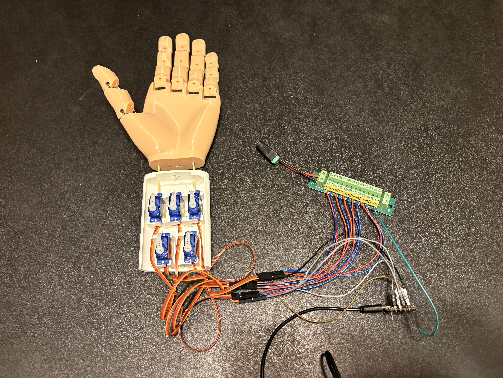
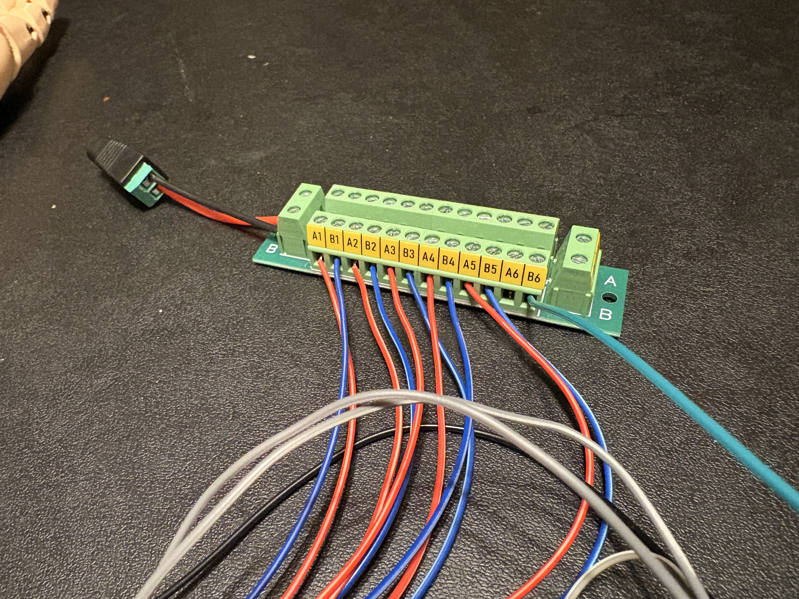
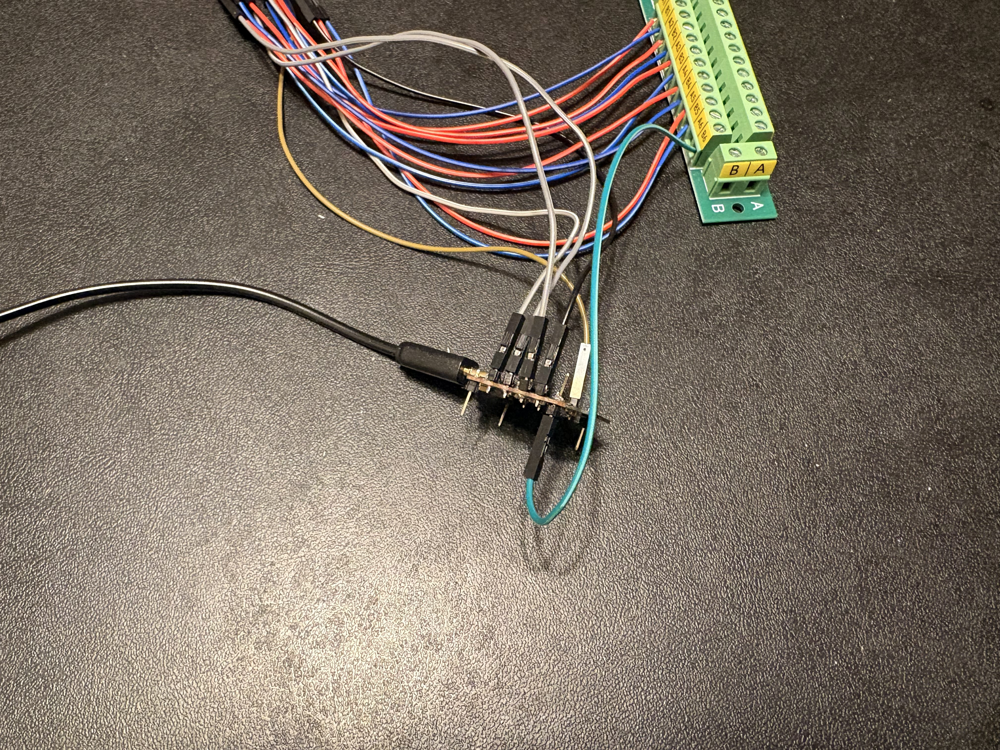
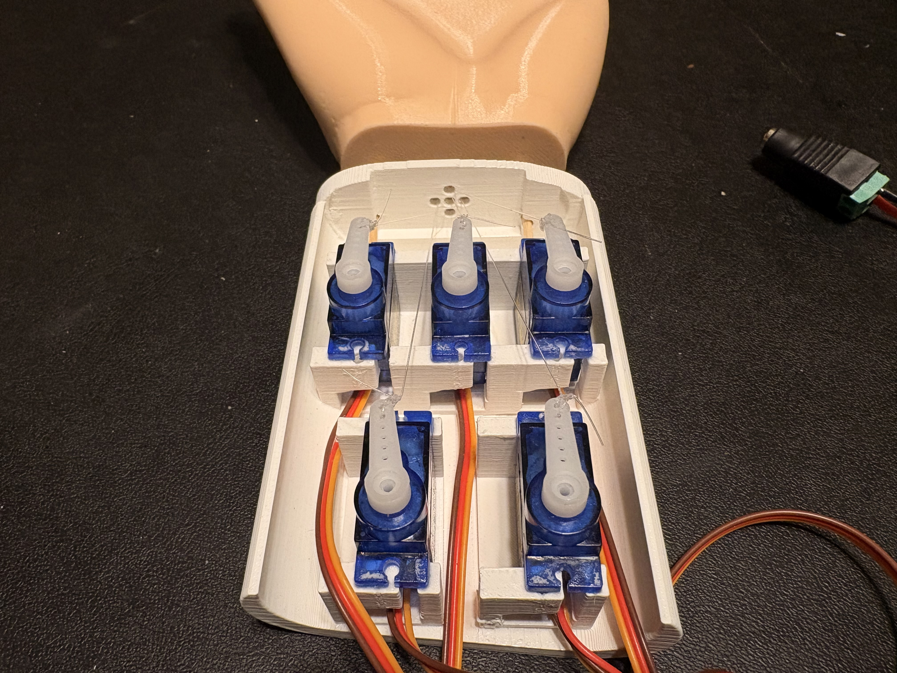
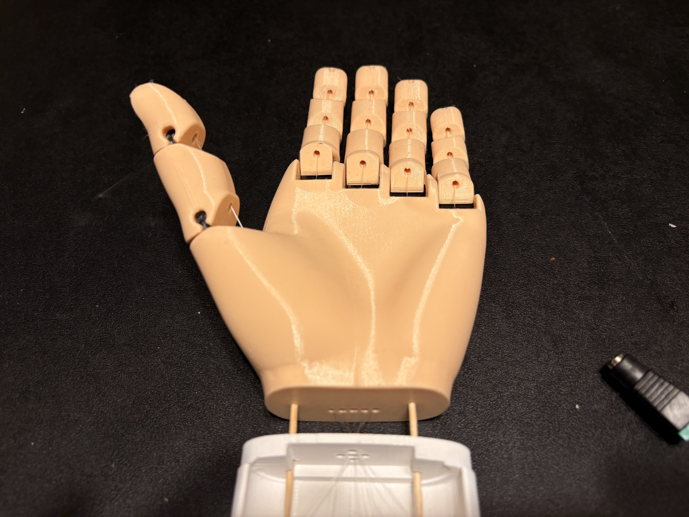

# FreeHand 🤖✋

<p align="center">
  
</p>

<p align="center">
  Real-time hand tracking → physical robotic hand using computer vision + embedded systems
</p>

<p align="center">
  
  
  
  
  
</p>

## ⚡ Quick Start (Vision Only)

Run the hand tracking system locally (no hardware required):

```bash
git clone https://github.com/jfasoltholmes/FreeHand
cd FreeHand
mise install
uv sync
uv run python main.py
```

⚠️ This demo does **not** control the robotic hand yet.

See [Hardware Setup](#hardware--assembly-notes) for full system integration.

## Why FreeHand?

FreeHand explores real-time human-to-robot motion mapping using accessible tools.
The goal is to bridge computer vision and physical interaction in a simple and reproducible system.

## 🧠 FreeHand Overview
FreeHand is a real-time hand tracking system using OpenCV and MediaPipe that maps human hand motion to a motorized, 3D-printed robotic hand.

This system combines:
- 👁️ Computer vision (MediaPipe hand tracking)
- 🎯 Signal mapping (finger distance normalization)
- ⚙️ Embedded control (Bluno Beetle v1.1 microcontroller)
- 🦾 Mechanical design (3D-printed articulated hand)

## 🏗️ System Architecture

### Software
 - Real-time hand tracking using MediaPipe
 - Landmark-based finger state extraction
 - Normalized distance mapping to control signals
### Hardware
 - Bluno Beetle v1.1 microcontroller
 - 5x SG90 Servo motors (one per finger)
 - External power distribution via screw terminal
 - 6V DC power supply (recommended high current, e.g. 10A)
### Mechanical
 - 3D-printed hand structure
 - 3D-printed servo wrist mounting bracket
 - Tendon-driver finger actuation using fishing line
 - Flexible joints and segmented finger design

## 📊 Project Status
### Implemented 
 - Real-time hand tracking via webcam
 - MediaPipe landmark detection
 - Finger state extraction using normalized distance
 - Thumb-specific control model (middle MCP reference)
 - Servo-safe motion range calibration (0-150°)

### In Progress
 - Serial communication (Python → Bluno Beetle)
 - Real-time servo actuation

## 🛠 Setup (Software + Hardware)
### Software Prerequisites
- Install [mise-en-place](https://mise.jdx.dev/) (manages project Python version)
- Install [uv](https://github.com/astral-sh/uv) (fast venv + dependency sync)
- A working webcam

### Software Setup
#### Clone the repo and enter it: 
```bash
git clone https://github.com/jfasoltholmes/FreeHand
cd FreeHand
```
#### Install/use the project’s Python version:
```bash
mise install
mise use -g python@$(cat .python-version)  # optional if you want it global
```
*(If you already have mise configured, mise install is usually enough.)*

#### Create the virtual environment + install deps from lockfile:
```bash
uv sync
```
#### Run:
```bash
uv run python main.py
```
#### Notes:
 - Ensure hand_landmarker.task remains in the project root (or update the path in main.py).
 - Press q to quit.

### Firmware Prerequisites
Required to modify or flash the microcontroller:

- Install [VSCode](https://code.visualstudio.com/)
- Install [PlatformIO Extension](https://platformio.org/)

### Hardware & Assembly Notes
#### Microcontroller Setup
- The Bluno Beetle v1.1 does not come with header pins pre-installed.
- Solder header pins to all required I/O and power pins before use.
- Firmware is built and flashed using PlatformIO in VSCode.
- The board connects to your computer via USB (must support data transfer, not power-only).
#### 3D Printed Components
- Hand model files and assembly instructions [here.](https://www.thingiverse.com/thing:242639)
- Servo mounting bracket [here.](https://www.thingiverse.com/thing:3940835/files)
#### Servo Preparation & Installation
1. Use 5x SG90 servo motors (one per finger).
2. Before installation, power each servo and rotate it to 0 degrees. 
3. Attach the servo lever arm with the point facing toward the hand.
4. Install servos into the wrist mount:
    - The mount includes screw holes, but super glue can be used for tighter placement.
    - Ensure spacing prevents servo arms from colliding.
#### Tendon Routing
- Use stiff fishing line as tendons.
1. Thread each line through the servo holder holes.
2. Continue routing through the base of the hand.
3. Feed through each finger segment.
4. Tie securely at the fingertips.
 - Once routed, lightly pretension each tendon and tie it to the servo arm.
#### Servo Mapping
- Each servo corresponds to a finger:

    | Servo Position | Finger |
    |----------------|--------|
    | Bottom Left    | Pinky  |
    | Top Left       | Ring   |
    | Top Middle     | Middle |
    | Top Right      | Index  |
    | Bottom Right   | Thumb  |

### Wiring

#### Signal Wiring (Bluno Beetle → Servos)
- Pinky → A0
- Ring → D2
- Middle → D3
- Index → D4
- Thumb → D5

#### Power Distribution
 - Each servo has a positive, ground, and signal. This is red, brown, and orange respectively.
 - **Power setup:**
    - Connect servo red wires → screw terminal A rail (positive) via stripped Dupont wire
    - Connect servo brown wires → screw terminal B rail (ground) via stripped Dupont wire
    - Use terminals A1–A5 / B1–B5 (pinky → thumb)
- **Common Ground:**
    - Connect Bluno Beetle GND → B6 on the screw terminal using a stripped Dupont wire.
- **External Power:**
    - Use a 6V DC power supply connected to the screw terminal.
    - Positive → A rail
    - Ground → B rail

## 🔄 System Behavior (Current Firmware) 
- After flashing the firmware and powering the system, each servo will: 
    - Move to 150° (closed position)
    - Return to 0° (open position)
    - Repeat continuously.
- This serves as a hardware validation loop until vision control is integrated.

## 🖼 Visual References

### Screw Terminal Wiring
<p align="center">
  
</p>
<p align="center">
  <em>Servo positive (red) and ground (blue) wiring. Shared ground (green).</em>
</p>

### Bluno Beetle
<p align="center">
  
</p>
<p align="center">
  <em>Servo signal connected via Dupont wires. Shared ground (green).</em>
</p>

### Servo Wrist Bracket
<p align="center">
  
</p>
<p align="center">
  <em>Fishing line routing from servos to fingertips.</em>
</p>

### Hand
<p align="center">
  
</p>
<p align="center">
  <em>3D-printed hand in relaxed pose.</em>
</p>

## 📁 Repository Structure
```bash
FreeHand/
├── firmware/              # Embedded code (Bluno Beetle via PlatformIO)
├── handfiles/             # 3D printable hand components
├── images/                # README visuals and setup references
│
├── main.py                # Hand tracking entry point
├── hand_landmarker.task   # MediaPipe model
│
├── pyproject.toml         # Python dependencies
├── uv.lock                # Locked dependencies
├── mise.toml              # Python/toolchain management
├── .python-version
│
├── README.md
└── .venv/                 # Local environment (ignored)
```